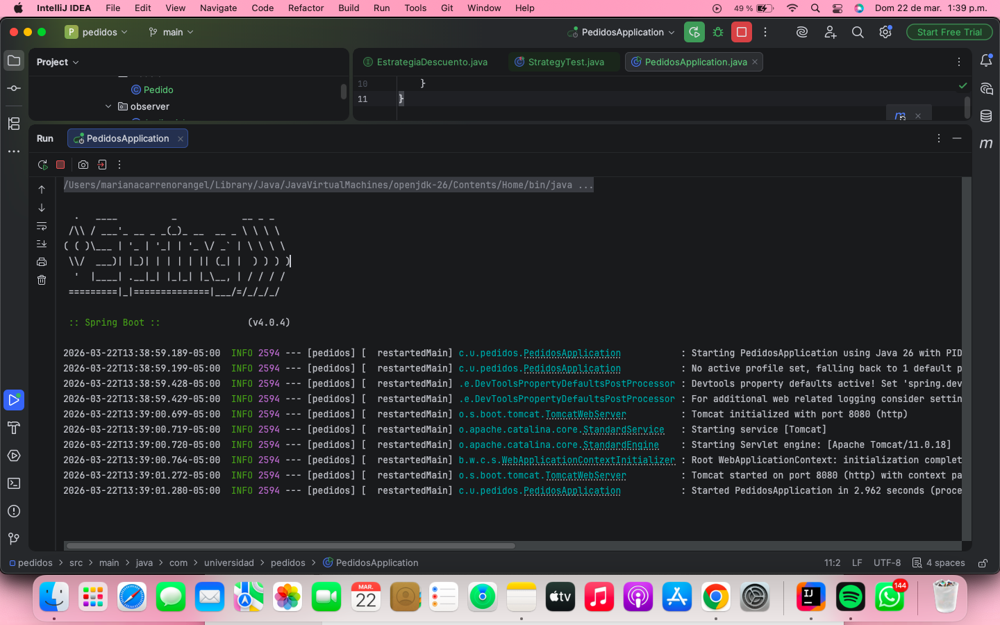
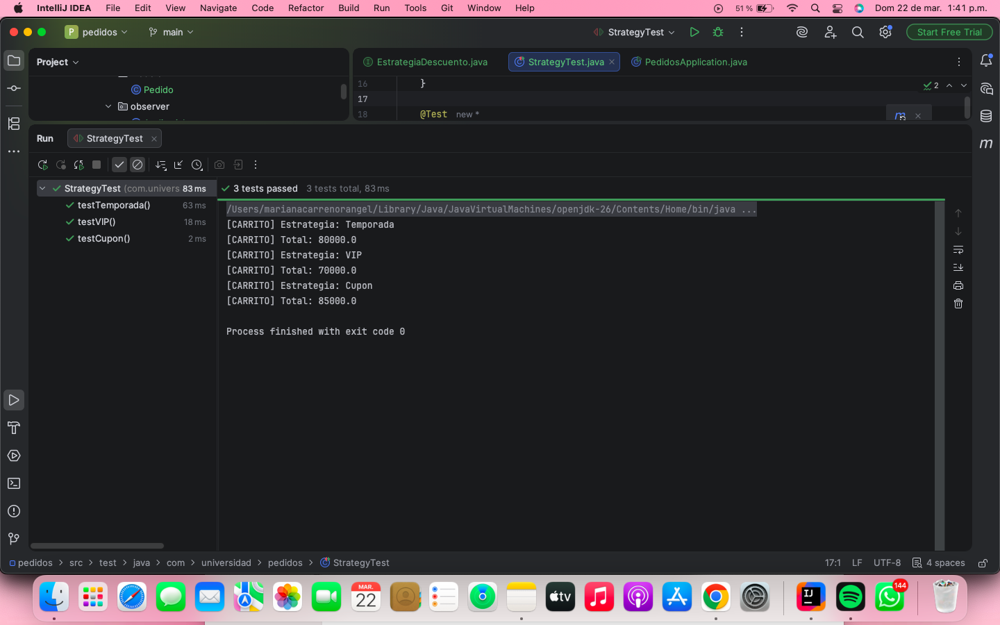

# 🧩 Sistema de Pedidos – Patrones Observer y Strategy

## 📌 Descripción

Este proyecto implementa los patrones de diseño **Observer** y **Strategy** en un sistema de pedidos usando **Spring Boot**.

* **Observer:** notifica automáticamente módulos cuando cambia el estado de un pedido.
* **Strategy:** permite aplicar distintos descuentos dinámicamente al carrito de compras.

---

## 🏗️ Estructura del Proyecto

```
src/main/java/com/universidad/pedidos

├── observer/   → Eventos y suscriptores (Observer)
├── strategy/   → Estrategias de descuento (Strategy)
├── modelo/     → Clase Pedido
└── PedidosApplication.java
```

---

## 🔹 Patrón Observer

### ✔️ Implementación

Se utiliza el sistema de eventos de Spring:

* **Publisher:** `GestorPedidosService`
* **Eventos:**

    * `PedidoConfirmadoEvent`
    * `PedidoCanceladoEvent`
* **Suscriptores:**

    * `EmailNotifier`
    * `InventarioUpdater`
    * `AuditoriaLogger`

### 🔁 Flujo de eventos

1. Se confirma o cancela un pedido
2. Se publica un evento con `ApplicationEventPublisher`
3. Los suscriptores reaccionan automáticamente con `@EventListener`

### 🧠 Evidencia (salida en consola)



---

## 🔹 Patrón Strategy

### ✔️ Implementación

Interfaz:

* `EstrategiaDescuento`

Estrategias:

* `DescuentoTemporada` → 20%
* `DescuentoVIP` → 30%
* `DescuentoCupon` → $15.000

Contexto:

* `CarritoService`

### 🔁 Funcionamiento

* Spring inyecta todas las estrategias como lista
* Se selecciona una estrategia en tiempo de ejecución
* El cálculo del total depende de la estrategia activa

### 🧠 Evidencia (TEST)



✔️ Cambio dinámico de estrategia sin modificar código
✔️ Cumple principio Open/Closed

---


Se ejecutan con:

```
mvn test
```

Resultados esperados:

* ✔️ Descuento temporada correcto
* ✔️ Descuento VIP correcto
* ✔️ Cupón aplicado correctamente
* ✔️ Cambio de estrategia funciona
* ✔️ Estrategia inválida lanza excepción

---

